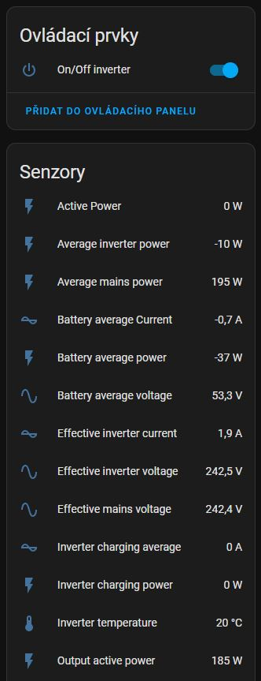
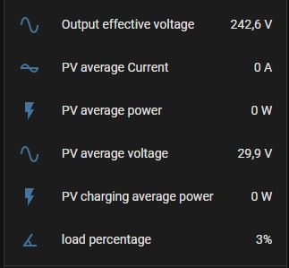

## A MQTT bridge for EASUN SMG II. ##

1. Install https://github.com/incub77/solis2mqtt
2. For support EASUN SMG II import solis_modbus.yaml of this project. There is a complete description of the inverter registers in the doc folder, so you can easily add additional data.

